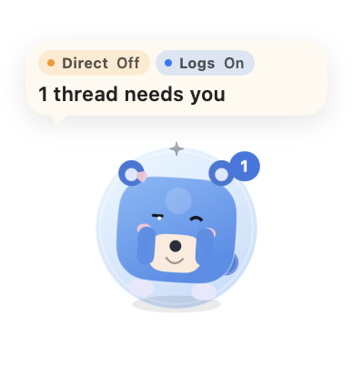
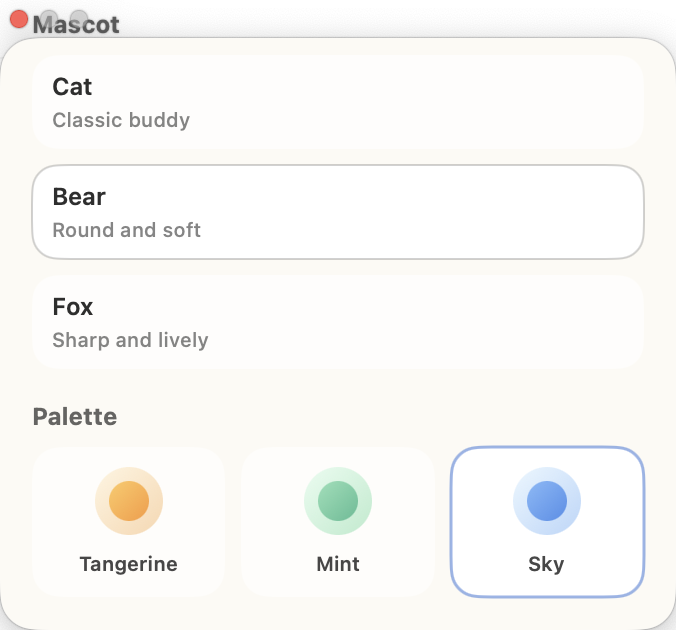

# CodexPet

[English](./README.md) | [简体中文](./README.zh-CN.md)

CodexPet 是一个盯着 Codex 状态的 macOS 桌面宠物。

它常驻桌面、保持顶层显示，在有线程运行或有完成但未读的线程时给出直观反馈；点一下宠物，就能直接跳回 Codex。

## 截图

### 运行态



当 Codex 有活跃线程时，宠物会进入明显的工作态，同时把未读计数保持在一个低打扰的展示层级。

### 样式面板



你可以在内置样式面板里切换宠物造型、配色和整体气质。

## 功能

- 展示已经完成但还没查看的 Codex 线程数量
- 检测运行中的线程，并切换宠物到工作态
- 在线程完成时做轻量提示和庆祝反馈
- 在气泡里展示轻量系统资源信息，包括 CPU 使用率和内存已用/总量
- 保持顶层显示，减少频繁切回 Codex 的次数
- 支持多套宠物造型、配色和表情
- 可以像普通 `.app` 一样从启动台启动

## 最近更新

- 新增了基于窗口像素的 unread 蓝点视觉兜底，在新版 Codex 的 AX 结构不够稳定时，会优先按可见蓝点来数未读
- 收紧了前台 completion bonus 的清理逻辑，避免当前线程已经没有未读标记时右上角数字还残留
- 气泡里新增了一行轻量系统资源信息：CPU 使用率和内存已用/总量
- 明确了新的权限模型：想要最准确的 unread 结果，`CodexPet.app` 需要同时拥有辅助功能权限和屏幕录制权限

## 为什么做它

Codex 很适合在后台跑任务，但它的反馈还是偏“窗口内”：你通常还是得切回应用，才能知道某个任务是不是已经结束。

我想把这个体验改成更平静的一种：

- 有线程在跑，宠物就显得忙碌
- 有线程完成但没读，数字就持续挂着
- 没有新状态时，它就安静待着

目标不是再做一个 dashboard，而是把 Codex 的线程状态变成一种常驻、低打扰、可感知的桌面反馈。

## 工作方式

CodexPet 会把几类本地信号合并成一个统一状态，再驱动宠物 UI。

### 1. Accessibility 检测

它通过 macOS Accessibility API 读取 Codex 窗口，识别：

- 左侧线程列表里的未读蓝点
- 线程列表里的运行中转圈标记
- 当前活跃线程

### 1.5. 视觉 unread 兜底

当最新版 Codex 的 AX 树无法稳定暴露 unread 状态时，CodexPet 也可以直接对窗口截图中的左侧蓝点做像素识别，用可见蓝点数来兜底。

### 2. 本地 Codex 状态

它会读取 `~/.codex` 下的本地状态文件，用来补强“运行中线程”的判断。

### 3. 日志与直连事件

它会 tail Codex 相关日志，并接入直连事件源，用来捕获任务完成事件，驱动宠物的反馈动作。

这些信号最后会被收敛成一个统一快照，用来控制气泡文案、计数和动画状态。

## 运行要求

- macOS 13 及以上
- 已安装 Codex 桌面应用
- 已给 `CodexPet.app` 开启辅助功能权限
- 想要最准确的蓝点 unread 识别，还需要给 `CodexPet.app` 开启屏幕录制权限

没有辅助功能权限时，CodexPet 无法稳定读取 Codex 左侧线程列表。
没有屏幕录制权限时，新的蓝点视觉兜底无法工作，应用会退回到只靠 AX 的 unread 推断。

## 适用范围

CodexPet 目前是一个明确面向 macOS Codex 桌面应用的伴生工具。

它当前不面向：

- 只使用 Codex CLI 的场景
- 只有终端、没有 Codex 桌面窗口的工作流
- 非 macOS 平台

现在的未读数和运行态判断都依赖桌面版 Codex 的窗口与侧边栏结构，所以这个项目应该被理解为一个 macOS 桌面 companion，而不是通用的 Codex 状态监控器。

## 本地运行

```bash
swift build
zsh Scripts/build-app.sh
open dist/CodexPet.app
```

安装到启动台：

```bash
zsh Scripts/install-to-launchpad.sh
```

## 项目结构

```text
CodexPet/
├── AppBundle/       # App 图标与 Bundle 元信息
├── LaunchAgents/    # 可选的开机启动支持
├── Scripts/         # 构建与安装脚本
├── Sources/         # SwiftUI 应用、监控器、状态聚合
├── Tests/           # 检测器与状态格式化测试
└── Package.swift
```

## 当前重点

这个项目目前聚焦在一个很实际的问题上：一个小型、始终置顶的桌面伙伴，能不能让 Codex 的使用体验更“活”，但又不更吵。

所以当前实现重点主要放在：

- 未读状态判断足够准
- 运行态判断尽量稳
- UI 反馈低噪声
- 宠物足够有表现力，但不过度打扰

## 已知限制

- 当前项目仅针对 macOS 版 Codex 桌面 App，不支持把 Codex CLI 作为主要接入面
- 部分检测依赖 Codex 当前 UI 结构，Codex 大改版后可能需要重新适配
- 运行中线程数目前仍然是多信号合并推断，不同 Codex 版本下可能还要继续校准
- 蓝点 unread 识别在给了屏幕录制权限后最准确；没有这个权限时，会退回到较弱的 AX-only 推断
- 重新安装或替换 `CodexPet.app` 后，macOS 可能会重置辅助功能权限；一旦发生这种情况，顶部 `AX` 会变成 `Off`，基于侧边栏的 unread 检测也会失去可信度
- 当前实现主要围绕我自己的 Codex 工作流和桌面布局优化

## 说明

这是一个围绕 Codex 桌面工作流的非官方伴生项目，不是 OpenAI 官方应用。
